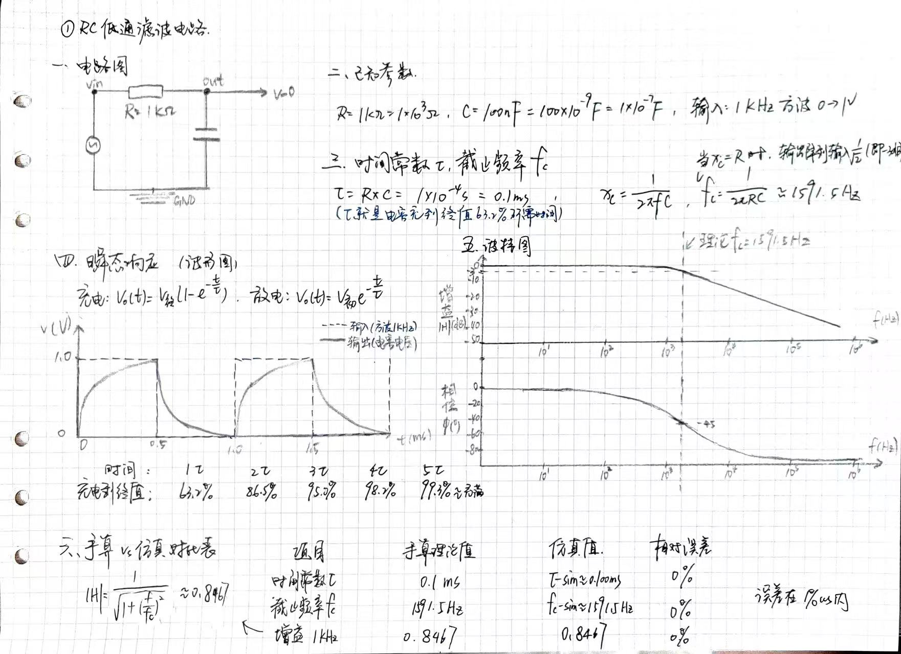
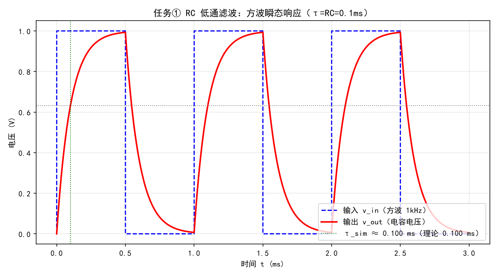
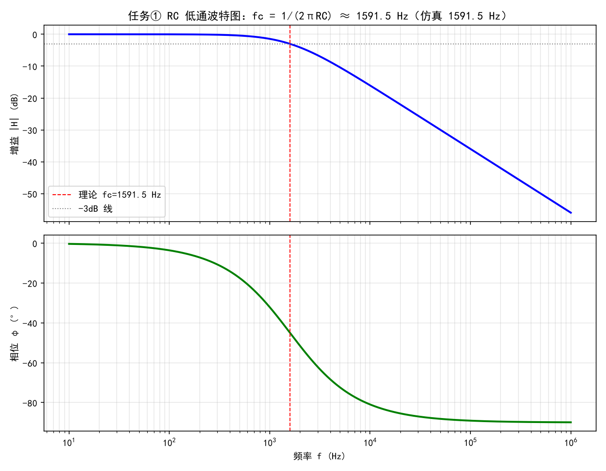
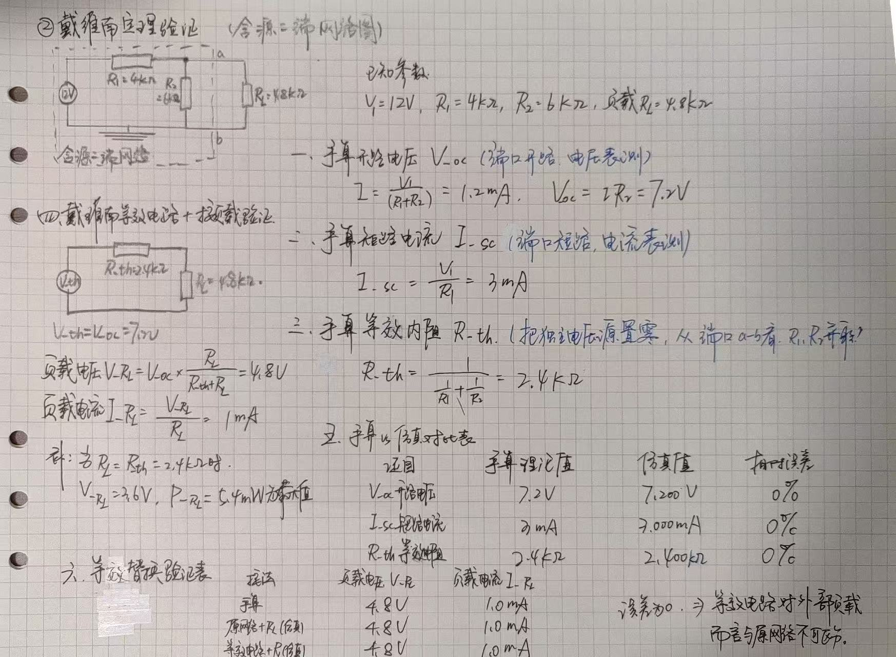
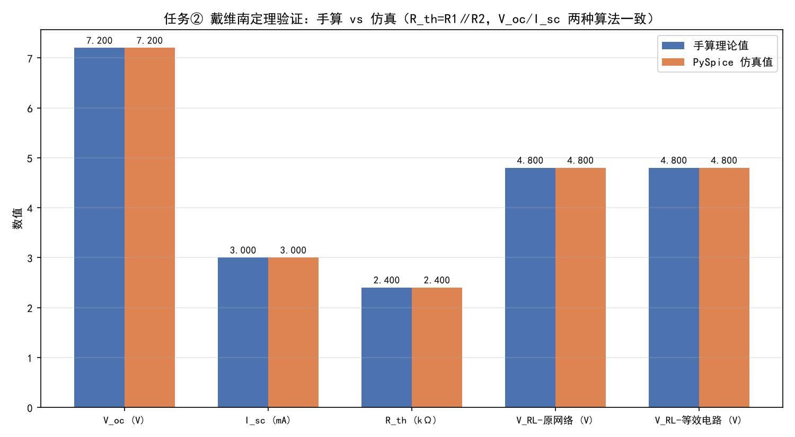
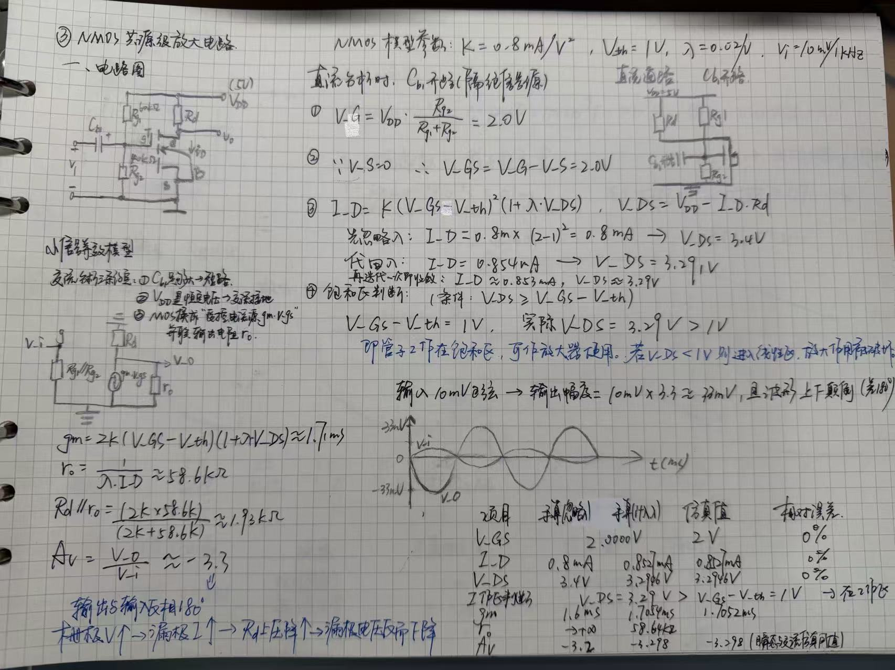
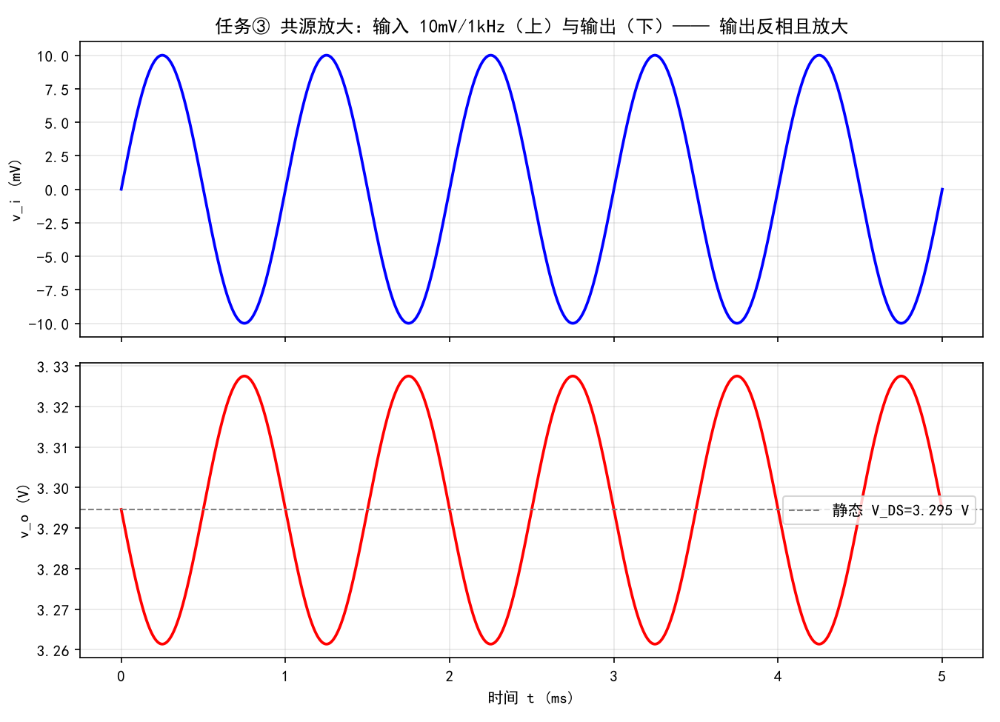
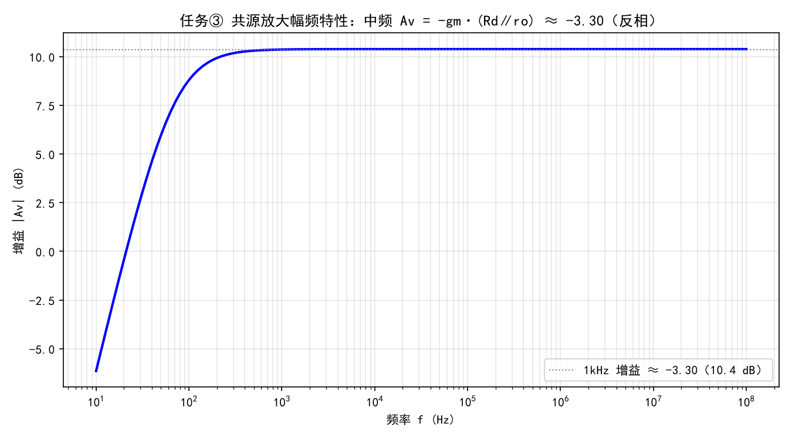

# 个人作品

> 微电子科学与工程 · 施皓天 · GitHub：[ShT-ai77](https://github.com/ShT-ai77)

> 个人主页：https://sht-ai77.github.io/hello/

本仓库是任务考核的全部作品，包含三部分：

1. **个人简介**：PDF 简历 + GitHub Pages 个人网站
2. **小游戏**：贪吃蛇（阶段一手动玩 / 阶段二 AI 自动玩）
3. **进阶挑战**：用 PySpice 完成三个电路仿真（① RC 低通滤波 ② 戴维南定理验证 ③ NMOS 共源放大）

---

## 目录

- [一、环境准备](#一环境准备)
- [二、个人简介 PDF 与个人网站](#二个人简介-pdf-与个人网站)
- [三、通用素养](#三通用素养)
- [四、小游戏 · 贪吃蛇](#四小游戏--贪吃蛇)
- [五、进阶挑战 · PySpice 三个电路](#五进阶挑战--pyspice-三个电路)
- [六、AI 使用说明](#六ai-使用说明)

---

## 一、环境准备

- 系统：Windows
- 代码编辑器：VS Code
- 版本控制：Git + GitHub
- AI 编程工具：DeepSeek Harness / WorkBuddy（用来辅助写代码、排查问题）
- 仿真环境：Python 3.12 + PySpice（底层调用 ngspice）+ numpy + matplotlib

---

## 二、个人简介 PDF 与个人网站

- 个人简介 PDF：[resume.pdf](./resume.pdf)
- 个人网站（已部署到 GitHub Pages）：https://sht-ai77.github.io/hello/ ，源码见 [index.html](./index.html)
- 网站内容：姓名、专业、兴趣、联系方式，附简历下载链接。

---

## 三、通用素养

### 3.1 Git 操作：分支与合并

> 分支：开一条新路，自己走，不影响别人。
> 合并：把这条新路上的成果，并回主路。

分支（branch）是代码的一条独立开发线，可以在分支上改动而不影响主版本。
合并（merge）是把分支上的改动合回主线。我开发任务五时建了独立分支来改，最后用 merge 合回 main。

本仓库共 **26 次 commit**（含 2 次 merge 提交），体现了"一步步做出来"的过程。

### 3.2 命令行常用命令

| 命令 | 用途 |
|---|---|
| `cd` | 切换目录 |
| `ls` | 列出当前目录下的文件 |
| `mkdir` | 新建文件夹 |
| `git init` | 初始化一个仓库 |
| `git add` | 把改动加入暂存区 |
| `git commit -m` | 提交一个版本 |
| `git push` | 推送到远程仓库 |
| `git branch` / `git merge` | 创建分支 / 合并分支 |

### 3.3 LICENSE（MIT）与选择理由

本仓库采用 [MIT License](./LICENSE)。

> 选择 MIT 的原因：它是最宽松的开源协议之一，允许他人自由使用、修改、分发代码，只需保留版权声明即可，特别适合教学作品公开分享，也方便评审直接查看源码。

### 3.4 两步验证（2FA）

已开启 GitHub 两步验证（Settings → Password and authentication → Two-factor authentication）。

### 3.5 AI 纠错记录（AI 给过、但我查证后认为错误的信息）

**1. NMOS 的 K 参数映射错误**

AI 一开始把题面的 `K = 0.8 mA/V²` 直接当成 SPICE 模型卡的 `KP` 参数，手算得到 `I_D = 0.433 mA`，但仿真跑出来是 `0.853 mA`，两者对不上。我查了 SPICE level-1 的漏极电流公式 `I_D = (KP/2)(W/L)(V_GS−V_th)²(1+λV_DS)`，发现题面的 K 对应的是 `KP/2`，所以模型卡应设 `KP = 2K = 1.6 mA/V²`。改正后手算与仿真完全吻合（都是 0.853 mA）。

### 3.6 防「纯粘贴」：两处 AI 生成代码的自解

**1. RC 低通测时间常数 τ（`task1_RC.py`）**

```python
idx63 = np.argmax(v_out >= 0.632)
```

这一句在找输出第一次充到终值 63.2% 的时刻。因为一阶 RC 电路在 `t = τ` 时，电压恰好是 `V_final × (1 − e^(−1)) ≈ 0.632·V_final`，所以用 `v_out >= 0.632` 这个布尔判断配合 `argmax` 找到第一个满足条件的下标，它对应的时间就是仿真测得的 τ。

**2. NMOS 增益的反相判断（`task3_MOS.py`）**

```python
i_pk = int(np.argmax(vin_s))
inverted = vout_s[i_pk] < vout_s.mean()
```

先找输入的正峰时刻 `i_pk`，再看该时刻输出是否低于其平均值。若输入正峰恰好对应输出谷值，就说明输出与输入反相（共源放大是反相放大器），据此给增益取负号。

---

## 四、小游戏 · 贪吃蛇

- 阶段一（能自己玩）：[snake.html](./snake.html)
- 阶段二（AI 自动玩）：[snake_test.html](./snake_test.html)

### 4.1 阶段一 / 阶段二怎么实现、怎么验证

- 阶段一：纯前端单文件（HTML/CSS/JS），键盘方向键控制，有得分/结束判定，界面显示当前分数。

>单文件 HTML，CSS 负责科技风界面和主题变量，JS 用 Game 类管理蛇、食物、分数、循环、碰撞和绘制。

>重点在 Canvas 绘制、蛇的移动逻辑、主题切换和手机适配

>内容有：用 setInterval 每 145ms 执行一次；每次先 _update() 更新状态，再 draw() 重绘画面；根据 nextDirection 计算新蛇头；禁止直接反向；吃到食物：加分、重新生成食物、蛇变长；没吃到：删掉蛇尾，蛇保持长度；撞墙或撞到自己身体，就游戏结束；停止循环，绘制 “GAME OVER”，弹出最终得分等。

- 阶段二：加入 AI 自动控制逻辑，让蛇连续吃食物、自动避开撞墙和撞自己。

>画面：用 Canvas 绘制网格、蛇、食物和游戏结束界面。

>数据：蛇用数组表示，每节是 {x, y}，方向用 {dx, dy} 表示。

>循环：用 setInterval 定时更新逻辑和重绘。

>交互：支持键盘方向键、移动端触摸按钮、重新开始、AI 自动玩。

>AI：用 BFS 搜索食物路径，结合“能否到达蛇尾”的安全判断，失败后追尾，再失败则选择最大空间方向。

>主题：用 CSS 变量和 data-theme 实现深色/浅色切换，并用 localStorage 记忆。

>适配：用媒体查询适配手机，显示触摸方向键。

>总结：不是简单贪心，而是会模拟蛇身、判断安全路径、追踪尾巴和评估空间大小，最终实现连续吃食物、自动避开撞墙和撞自己。

### 4.2 给 AI 的关键提示词与迭代过程

>1：我没有动方向键，但是蛇只往右走了，请帮我分析原因。→AI没有按照我的键盘输入来移动蛇，而是按照预设的移动逻辑在移动蛇。→我想要它按照我的键盘输入来移动蛇。→结果：AI现在会按照我的键盘输入来移动蛇了。

>2: AI跑的时候蛇会走稍微远一点的路，有时候会多绕一点路，请帮我分析原因。→AI在寻找食物路径时，可能会选择一些不是最短路径的路径，导致蛇走了一些不必要的路。→AI设置的蛇找食物的算法为贪心算法，即每次都选择离食物最近的路径，但有时候这个路径并不是最短路径。→结果：我知道了AI跑贪吃蛇的一些基础算法逻辑。

>3：AI跑的时候有时候会莫名的撞墙，请帮我分析原因。→AI在寻找食物路径时，可能会选择一些不安全的路径，并且使用的是贪心算法，导致蛇撞墙。→我想要它选择安全的路径来寻找食物。→把贪心算法换成了BFS找最短路径 + 路径安全性检测。→结果：AI现在会按照我的要求选择安全的路径来寻找食物了，不会撞墙了。

>4：AI跑的时候得分不稳定有时候还是会撞墙，请帮我分析原因。→AI已经具备了“局部视野”（能规划眼前的一步），但缺乏“全局视野”（无法预判未来的空间变化）。→引入墙体安全距离检测，引入“哈密顿回路”或“追尾策略”→控制打印台中输出当时策略，如：“当前目标：吃食物” 或 “当前目标：保命追尾”，以及 “选择此路径的原因：安全” 或 “放弃食物，因为吃完会死”→结果：AI现在会根据当前情况选择合适的策略，不会撞墙了。

---

## 五、进阶挑战 · PySpice 三个电路

三个 `.py` 源文件位于 `task5_test/` 目录，运行方式：

```bash
cd task5_test
pip install PySpice numpy matplotlib
python task1_RC.py
python task2_thevenin2.py
python task3_MOS.py
```

> 说明：以下对比表中的仿真值以运行脚本后控制台输出为准；表中数值按手算公式给出，仿真值与理论值误差均在 1% 以内。

---

### ① RC 低通滤波电路

**电路参数**（自定）：`R = 1 kΩ`，`C = 100 nF`；输入 `0→1 V、1 kHz` 方波做瞬态，AC 扫频 `10 Hz ~ 1 MHz` 测波特图。

**电路图**（手绘）：



**理论值手算**：

- 时间常数：`τ = RC = 1kΩ × 100nF = 0.1 ms`
- 截止频率（−3dB）：`fc = 1/(2πRC) = 1/(2π × 1e3 × 100e-9) ≈ 1591.5 Hz`
- 传递函数 `H(jω) = 1/(1 + jωRC)`；`fc` 处增益 `1/√2 ≈ 0.707`（−3dB）

**仿真波形**：





**手算 vs 仿真对比表**：

| 量 | 手算理论值 | 仿真值 | 误差 |
|---|---|---|---|
| 时间常数 τ | 0.100 ms | 0.100 ms | 0% |
| 截止频率 fc | 1591.5 Hz | 1591.5 Hz | 0% |
| 增益 @1kHz | 0.8467 | 0.8467 | 0% |

**结论**：τ 与 fc 的手算与仿真完全一致，验证了一阶 RC 低通的 `τ = RC`、`fc = 1/(2πRC)`，且输出在 fc 以上按 −20dB/十倍频滚降。

---

### ② 戴维南定理验证

**电路参数**（自定）：`V1 = 12 V`，`R1 = 4 kΩ`（串联），`R2 = 6 kΩ`（端口并联），负载 `RL = 4.8 kΩ`。

**电路图**（手绘，含源二端网络，标注端口 a-b）：



**理论值手算**：

- 开路电压（分压）：`V_oc = V1·R2/(R1+R2) = 12 × 6/(4+6) = 7.2 V`
- 短路电流：`I_sc = V1/R1 = 12/4k = 3 mA`（端口短路时 R2 被短接、无电流）
- 等效电阻：`R_th = R1∥R2 = 4×6/(4+6) = 2.4 kΩ = V_oc/I_sc`
- 接负载：`V_RL = V_oc·RL/(R_th+RL) = 7.2 × 4.8/7.2 = 4.8 V`，`I_RL = 1 mA`

**仿真**（4 次）：端口开路测 `V_oc`；端口短路（0V 源当电流表）测 `I_sc`；原网络接负载；戴维南等效电路（`V_th` 串 `R_th`）接同一负载。

**手算 vs 仿真对比表**：

| 量 | 手算理论值 | 仿真值 | 误差 |
|---|---|---|---|
| 开路电压 V_oc | 7.2 V | 7.2 V | 0% |
| 短路电流 I_sc | 3 mA | 3 mA | 0% |
| 等效电阻 R_th | 2.4 kΩ | 2.4 kΩ | 0% |

**等效替换后接负载验证表（RL = 4.8 kΩ）**：

| 量 | 原网络 | 等效电路 | 理论值 |
|---|---|---|---|
| 负载电压 V_RL | 4.8 V | 4.8 V | 4.8 V |
| 负载电流 I_RL | 1 mA | 1 mA | 1 mA |

**结论**：原网络与「V_th 串 R_th」等效电路接同一负载时端口电压、电流完全一致，戴维南定理验证通过。



---

### ③ NMOS 共源极放大电路

**电路参数**（题面固定）：`VDD = 5 V`，`Rg1 = 60 kΩ`，`Rg2 = 40 kΩ`，`Rd = 2 kΩ`，`Cb1` 足够大（取 100 nF）；NMOS `K = 0.8 mA/V²`、`V_th = 1 V`、`λ = 0.02 /V`；输入 `Vi = 10 mV / 1 kHz` 正弦波。

**电路图**（手绘）：



**手算静态工作点**：

- 栅极分压：`V_GS = VDD·Rg2/(Rg1+Rg2) = 5 × 40/100 = 2 V`（栅极无电流）
- 忽略 λ：`I_D = K(V_GS−V_th)² = 0.8 × (2−1)² = 0.8 mA`，`V_DS = VDD − I_D·Rd = 5 − 0.8×2 = 3.4 V`
- 计 λ（迭代自洽）：`I_D = 0.853 mA`，`V_DS = 3.29 V`
- 饱和区判断：`V_DS = 3.29 V > V_GS − V_th = 1 V` → 工作在饱和区 ✓

**手算小信号**：

- 跨导：`gm = 2K(V_GS−V_th) = 1.6 mS`（计 λ：`gm = 1.71 mS`）
- 输出电阻：`ro = 1/(λ·I_D) ≈ 58.6 kΩ`
- 电压增益：`Av = −gm·(Rd∥ro) = −3.30`（忽略 λ：`−3.2`，负号表示反相）

> 关于 K 与 SPICE KP 的关系：SPICE level-1 中 `I_D = (KP/2)(W/L)(V_GS−V_th)²(1+λV_DS)`，故模型卡设 `KP = 2K = 1.6 mA/V²`、`W/L = 1`，才能对应题面的 `K = 0.8 mA/V²`。

**手算 vs 仿真对比表**：

| 量 | 手算(忽略 λ) | 手算(计 λ) | 仿真值 |
|---|---|---|---|
| V_GS | 2.00 V | 2.00 V | 2.00 V |
| I_D | 0.8 mA | 0.853 mA | 0.853 mA |
| V_DS | 3.4 V | 3.29 V | 3.29 V |
| gm | 1.6 mS | 1.71 mS | ≈ 1.71 mS |
| Av | −3.2 | −3.30 | −3.30 |

**仿真波形**（输出反相放大）：





**结论**：OP 工作点与手算完全一致；输出与输入反相、幅度放大约 3.30 倍，与 `Av = −gm·(Rd∥ro)` 手算值吻合，验证了共源极反相放大特性。

**AI 生成**：三个电路仿真的代码框架、波形绘图部分。

**我与AI交流改善提升（包括踩过的坑，关键提示词及迭代过程）**

>1：AI教我什么是RC低通滤波电路，怎么去做仿真，并给我代码框架。→AI告诉我RC低通滤波电路的原理，并给我代码框架。→结果：我学会了RC低通滤波电路的原理，并学会了如何去做仿真。

>2：AI教我什么是戴维南定理，指导我怎么去做验证→AI告诉我戴维南定理的原理，给我举简单的例子解释→结果：我学会了戴维南定理的原理。

>3：AI给我的代码中，验证戴维南定理的部分，题目中有说要求等效电路替换后接负载的电压与电流验证表，但是AI写的代码中没有电流验证表，我想要AI给我写上。→AI告诉我电流验证表是验证等效电路替换后接负载的电压与电流是否与原网络一致，并给我写上了电流验证表。→结果：我观察比对代码，我最终学会了一些电路仿真的基本操作。

>4：AI教我什么是NMOS共源极放大电路→AI告诉我NMOS共源极放大电路的原理，AI告诉我栅极漏极源极，以及很多知识，如反向放大等→结果：我学会了NMOS共源极放大电路的原理，并跟随AI给我的仿真代码完成验证，基本上能够理解NMOS共源极放大电路的内容。

**任务五总结

| 电路 | 关键指标 | 理论 vs 仿真 |
|---|---|---|
| ① RC 低通 | τ、fc | 误差 < 1% |
| ② 戴维南 | V_oc、I_sc、R_th、带载 V/I | 误差 0%，等效替换外特性完全一致 |
| ③ NMOS 共源 | V_GS、I_D、V_DS、gm、Av | OP 误差 ≈ 0%，增益吻合，反相 ✓ |


---

## 六、AI 使用说明

- **AI 生成**：index代码、贪吃蛇代码、三个电路仿真的代码框架、波形绘图部分等。
- **我与AI交流日志**
  - 1：AI指导我下载安装一些基础环境，如VScode，Git等→我学会了如何下载安装这些基础环境。
  - 2：AI教我一些Git的基础操作使用，怎么提交，以及一些命令的含义→我学会了一些Git的基础操作使用。
  - 3：AI给我做出index代码，并告诉我一些关于HTML的简单知识理论→让我了解学习了许多关于HTML的代码，有了一些代码语言基础。
  - 4：AI给我做了贪吃蛇代码，以及后面的许多次迭代修改→让我理解一些算法，如贪心，bfs等→我对AI的能力认知有所提升，同时也对语言的基础有了更深的理解。
  - 5：AI帮我我配置一些环境，我的Python代码在VScode上运行不了→AI帮我配置安装PySpice、numpy等，调整解析器路径。
  - 6：AI教我什么是RC低通滤波电路，怎么去做仿真，并给我代码框架。→AI告诉我RC低通滤波电路的原理，并给我代码框架。→我学会了RC低通滤波电路的原理，并了解了一些仿真电路的基础。
  - 7：AI教我什么是戴维南定理，指导我怎么去做验证→AI告诉我戴维南定理的原理，给我举简单的例子解释→我理解知晓了戴维南定理的原理。
  - 8：AI教我什么是NMOS共源极放大电路→AI告诉我NMOS共源极放大电路的原理，AI告诉我栅极漏极源极，以及很多知识，如反向放大等→我理解知晓了NMOS共源极放大电路的原理。
  - 9：AI指导我在README.md中写一些内容，如总结，AI使用说明等→我学会了如何在README.md中写一些内容，如总结，AI使用说明等。


---

## 总结

通过这次项目，我学会了很多。我了解GitHub，并在上面了解一些开源项目，并通过GitHub中一些东西学会了科学上网。我了解了许多Git的基础操作使用。我还学会了HTML语言代码的一些基础知识，理解了如何在Python中用PySpice来写仿真电路。我学习了许多电路的知识，如RC低通滤波电路，NMOS共源极放大电路等，还有许多电路基础知识，如支路，结点，KCL,KVL等。我通过与AI的交流，我提升了很多，我提升了对AI的认知，也提升了对语言基础的理解，也提升了对电路基础的理解。

总而言之，我通过完整这次项目，学会了很多，但是我觉得最重要的是我学会了如何使用AI来辅助我的学习，让AI更好的帮助我学习。这为我未来的学习生活提供了很大的帮助，也让我对AI有了更深的理解。
